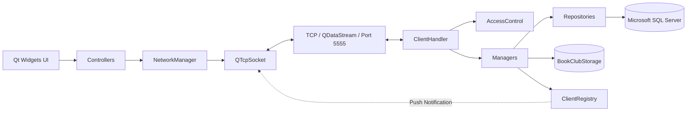
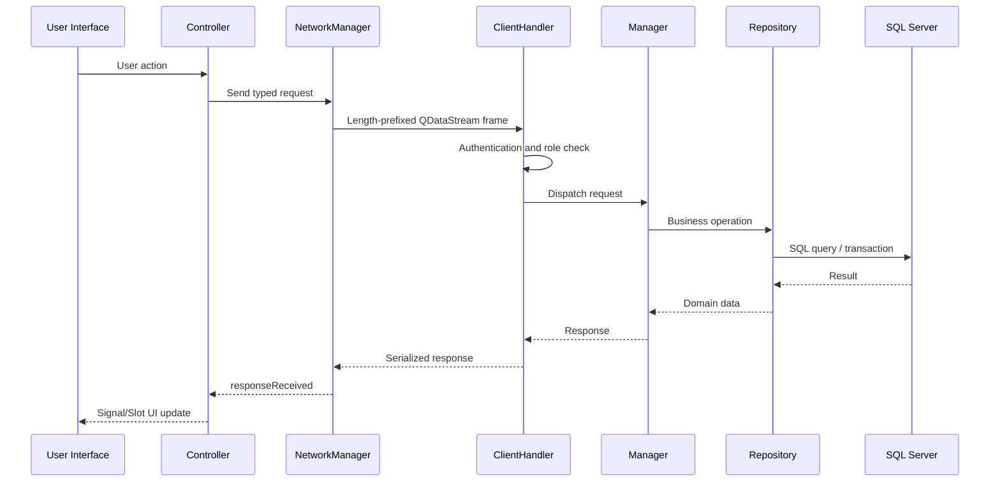
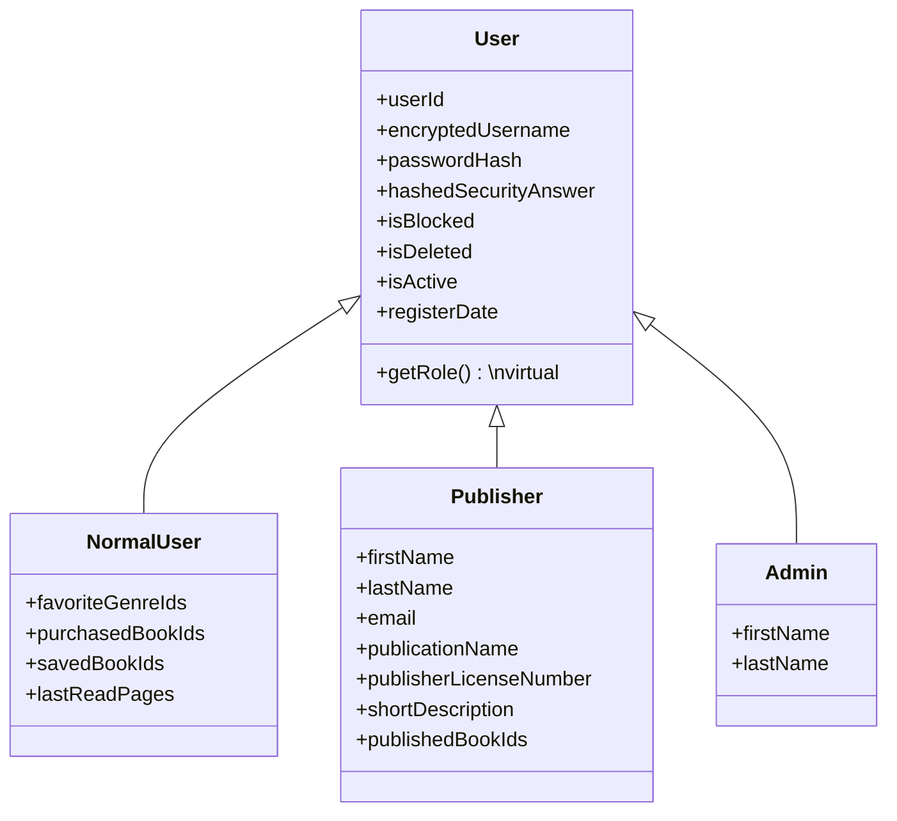

# bookCLUB_Project


سامانه دسکتاپ کتاب الکترونیکی مبتنی بر معماری **Client-Server**، پیاده‌سازی‌شده با **C++17، Qt 6 و Microsoft SQL Server**.

این پروژه یک سامانه دانشگاهی برای ثبت‌نام و احراز هویت کاربران، جست‌وجو و خرید کتاب، مدیریت کتابخانه شخصی، مطالعه فایل PDF، انتشار و مدیریت کتاب توسط ناشر، مدیریت کاربران و محتوا توسط مدیر سیستم و ارسال اعلان‌های لحظه‌ای است.

> این مخزن یک پروژه آموزشی است. برخی بخش‌ها، مانند پرداخت بانکی و پایش منابع سرور، شبیه‌سازی یا ساده‌سازی شده‌اند و برای استفاده Production نیازمند بازطراحی امنیتی و عملیاتی هستند.

---

## فهرست مطالب

- [نمای کلی](#نمای-کلی)
- [قابلیت‌ها](#قابلیت‌ها)
- [معماری سیستم](#معماری-سیستم)
- [مدل نقش‌ها و ارث‌بری](#مدل-نقشها-و-ارثبری)
- [ساختار پروژه](#ساختار-پروژه)
- [پایگاه داده](#پایگاه-داده)
- [پروتکل ارتباطی](#پروتکل-ارتباطی)
- [سیستم اعلان‌ها](#سیستم-اعلانها)
- [پیش‌نیازها](#پیشنیازها)
- [راه‌اندازی و اجرا](#راهاندازی-و-اجرا)
- [تنظیمات](#تنظیمات)
- [اعتبارسنجی‌ها و محدودیت‌ها](#اعتبارسنجیها-و-محدودیتها)
- [امنیت و کنترل دسترسی](#امنیت-و-کنترل-دسترسی)
- [رفع خطاهای متداول](#رفع-خطاهای-متداول)
- [محدودیت‌های فعلی](#محدودیتهای-فعلی)
- [نقشه راه](#نقشه-راه)
- [مشارکت در توسعه](#مشارکت-در-توسعه)
- [مجوز](#مجوز)

---

## نمای کلی

BookClub از سه نقش اصلی پشتیبانی می‌کند:

| نقش | کاربرد |
|---|---|
| کاربر عادی (`NormalUser`) | جست‌وجو، ذخیره، خرید، مطالعه و سازمان‌دهی کتاب‌ها |
| ناشر (`Publisher`) | انتشار و مدیریت کتاب‌ها، تخفیف، مشاهده آمار و دریافت اعلان فروش/نظر |
| مدیر (`Admin`) | مدیریت کاربران، کتاب‌ها، نظرات و مدیران دیگر |

برنامه از دو executable مستقل تشکیل شده است:

- **Client**: رابط کاربری مشترک کاربران عادی، ناشران و مدیران
- **Server**: سرور TCP، منطق کسب‌وکار، دسترسی به SQL Server و داشبورد پایش

ارتباط کلاینت و سرور روی TCP و به‌صورت پیش‌فرض از طریق آدرس زیر انجام می‌شود:

```text
Host: 127.0.0.1
Port: 5555
```

---

## قابلیت‌ها

### احراز هویت و حساب کاربری

- ثبت‌نام کاربر عادی
- ثبت‌نام ناشر
- ورود بر اساس نقش و انتقال به پنل مرتبط
- بازیابی رمز عبور با پاسخ امنیتی
- تغییر رمز عبور
- ویرایش حساب کاربری
- یکتا بودن نام کاربری
- جلوگیری از ورود کاربر مسدود، حذف‌شده یا غیرفعال
- ساخت مدیر جدید از داخل پنل مدیر
- نگهداری وضعیت نشست و نقش کاربر در کلاینت و سرور

### کاربر عادی

#### فروشگاه و صفحه اصلی

- نمایش همه کتاب‌ها
- نمایش جدیدترین کتاب‌ها
- نمایش کتاب‌های محبوب
- نمایش پرفروش‌ترین کتاب‌ها
- نمایش کتاب‌های رایگان
- نمایش کتاب‌های پیشنهادی بر اساس ژانرهای موردعلاقه
- جست‌وجوی کتاب
- مشاهده جلد و جزئیات کتاب
- مشاهده نام کتاب، نویسنده، ناشر، ژانر، دسته‌بندی، قیمت، تخفیف و توضیحات

#### ژانرهای موردعلاقه

- انتخاب ۱ تا ۳ ژانر در اولین ورود
- تغییر ژانرها از پروفایل
- دریافت پیشنهاد کتاب متناسب با ژانرها
- دریافت اعلان انتشار کتاب جدید در ژانر منتخب

#### نظر و امتیاز

- ثبت نظر
- ویرایش نظر متعلق به خود کاربر
- حذف نظر متعلق به خود کاربر
- مشاهده نظرات سایر کاربران
- ثبت یا به‌روزرسانی امتیاز ۱ تا ۵
- مشاهده میانگین امتیاز و تعداد رأی‌ها
- دریافت به‌روزرسانی لحظه‌ای تغییرات نظر و امتیاز

#### سبد خرید و سفارش

- افزودن کتاب به سبد
- حذف کتاب از سبد
- جلوگیری از ثبت تکراری یک کتاب در سبد
- محاسبه قیمت پایه، تخفیف و مبلغ نهایی
- ثبت سفارش و پرداخت شبیه‌سازی‌شده
- انتقال خودکار کتاب خریداری‌شده به کتابخانه کاربر
- دریافت اعلان فروش برای ناشر مربوطه

#### پروفایل

- مشاهده نام کاربری
- مشاهده تاریخ عضویت
- مشاهده تعداد کتاب‌های خریداری‌شده
- ویرایش نام کاربری، رمز و پاسخ امنیتی
- مشاهده تاریخچه سفارش‌ها با ستون‌های:
  - شماره سفارش
  - نام کتاب یا نام کتاب‌های سفارش
  - تاریخ سفارش
  - مبلغ نهایی
  - وضعیت سفارش

> مطابق مدل دامنه پروژه، کاربر عادی فیلد «نام» و «نام خانوادگی» ندارد. این دو فیلد فقط برای `Publisher` و `Admin` تعریف شده‌اند.

#### کتابخانه شخصی

کتابخانه سه بخش اصلی دارد:

1. **کتاب‌های من**
   - نمایش کتاب‌های خریداری‌شده
   - مشاهده جزئیات
   - بازکردن کتاب در PDF Reader داخلی

2. **کتاب‌های ذخیره‌شده و علاقه‌مندی‌ها**
   - ذخیره کتاب برای آینده
   - نمایش نام واقعی کتاب
   - حذف کتاب ذخیره‌شده
   - افزودن کتاب ذخیره‌شده به لیست علاقه‌مندی
   - حذف از علاقه‌مندی
   - مرتب‌سازی دلخواه علاقه‌مندی‌ها با Drag & Drop

3. **قفسه‌های شخصی**
   - ایجاد قفسه
   - تغییر نام قفسه
   - حذف قفسه
   - افزودن کتاب خریداری‌شده به قفسه
   - حذف کتاب از قفسه
   - مرتب‌سازی قفسه‌ها با Drag & Drop
   - مرتب‌سازی کتاب‌های داخل هر قفسه با Drag & Drop
   - ذخیره دائمی ترتیب در دیتابیس

#### PDF Reader

- دریافت فایل PDF از سرور
- نمایش در `QPdfView`
- صفحه قبل و بعد
- رفتن به صفحه مشخص
- بزرگ‌نمایی و کوچک‌نمایی
- نمایش شماره صفحه جاری و تعداد صفحات
- ذخیره آخرین صفحه مطالعه‌شده
- ادامه مطالعه از آخرین صفحه ذخیره‌شده

### ناشر

#### حساب ناشر

- مشاهده و ویرایش:
  - نام کاربری
  - رمز و پاسخ امنیتی
  - نام
  - نام خانوادگی
  - ایمیل
  - نام انتشارات
  - شماره پروانه نشر
  - توضیح کوتاه

#### مدیریت کتاب

- افزودن کتاب جدید
- انتخاب یا ایجاد دسته‌بندی
- انتخاب ژانر موجود
- ایجاد یا بازیابی نویسنده بر اساس نام
- بارگذاری تصویر جلد
- بارگذاری فایل PDF
- ثبت قیمت و تخفیف اولیه
- ویرایش کتاب در فرم مشترک افزودن/ویرایش
- حفظ فایل جلد و PDF قبلی در صورت انتخاب‌نکردن فایل جدید
- جایگزینی جلد یا PDF در صورت انتخاب فایل جدید
- غیرفعال‌کردن کتاب
- فعال‌سازی مجدد کتاب
- اعمال تخفیف درصدی در فرم فعلی؛ لایه سرور و مدل قیمت از تخفیف مبلغی نیز پشتیبانی می‌کنند.
- تعریف تخفیف زمان‌دار
- لغو تخفیف زمان‌دار

#### داشبورد ناشر

- تعداد کل کتاب‌های منتشرشده
- مجموع درآمد
- تعداد فروش هر کتاب
- میانگین امتیاز و تعداد رأی هر کتاب
- وضعیت فعال یا غیرفعال کتاب
- تخفیف فعلی و تخفیف زمان‌دار
- پنج کتاب پرفروش
- پنج کتاب کم‌فروش

#### اعلان ناشر

- دکمه اعلان با شمارنده خوانده‌نشده؛ مقدار اولیه `۰`
- به‌روزرسانی فوری شمارنده پس از Push جدید
- اعلان ثبت فروش جدید
- اعلان ثبت نظر جدید
- اعلان ثبت یا تغییر امتیاز
- بازکردن پنجره اعلان‌ها
- علامت‌گذاری اعلان به‌عنوان خوانده‌شده با کلیک روی آن
- نوسازی فوری شمارنده پس از خواندن اعلان

### مدیر سیستم

#### مدیریت کاربران

- مشاهده فهرست تمام کاربران
- جست‌وجو و فیلتر
- مشاهده اطلاعات کامل کاربر انتخاب‌شده
- اطلاعات کاربر عادی:
  - نام کاربری
  - ژانرهای موردعلاقه
  - تعداد کتاب‌های خریداری‌شده
  - تاریخ ثبت‌نام
  - وضعیت فعال‌بودن
  - وضعیت مسدودی
- اطلاعات ناشر:
  - نام و نام خانوادگی
  - نام انتشارات
  - شماره پروانه
  - ایمیل
- اطلاعات مدیر:
  - نام و نام خانوادگی
- مسدود و رفع مسدودی
- فعال و غیرفعال‌کردن حساب
- حذف منطقی حساب با پرچم `IsDeleted`
- ساخت مدیر جدید

#### مدیریت کتاب‌ها

- مشاهده تمام کتاب‌ها
- مشاهده جزئیات کامل:
  - نام کتاب
  - نام نویسنده
  - قیمت
  - ژانر
  - توضیحات
- ویرایش کتاب با بازکردن `publisheraddbookwindow_c` در حالت ویرایش
- بارگذاری تمام فیلدهای قبلی در فرم
- ویرایش هر کتاب، مستقل از ناشر مالک
- حذف کتاب

#### مدیریت نظرات

- مشاهده تمام نظرات
- حذف نظر نامعتبر یا متخلف

### داشبورد سرور

- رابط گرافیکی به‌جای اجرای صرفاً Console
- نمایش تعداد کاربران آنلاین
- نمایش اتصال و قطع اتصال کلاینت‌ها
- نمایش لاگ درخواست‌ها و وضعیت پاسخ
- وضعیت سلامت:
  - `Healthy`
  - `Busy`
  - `Overloaded`
- به‌روزرسانی خودکار هر ۲ ثانیه
- نمایش CPU تخمینی بر اساس بار اتصال
- نمایش RAM پردازش سرور روی ویندوز؛ مقدار جایگزین تخمینی در صورت عدم دسترسی
- نگهداری حداکثر تعداد مشخصی از لاگ‌های اخیر در حافظه

---

## معماری سیستم

### نمای سطح بالا



### جریان یک درخواست



### لایه‌ها

| لایه | مسئولیت |
|---|---|
| UI | فرم‌های Qt Designer و نمایش داده |
| Controller | اعتبارسنجی کلاینت و تبدیل رویداد UI به درخواست |
| Network | اتصال TCP، صف درخواست‌ها، Serialization و Push |
| Handler | احراز هویت، Dispatch و کنترل نقش |
| Manager | منطق کسب‌وکار و تراکنش‌ها |
| Repository | دسترسی مستقیم به SQL Server |
| Common | Entityها، Enumها، Request و Response مشترک |

---

## مدل نقش‌ها و ارث‌بری



نکته طراحی:

- اطلاعات مشترک در `User` قرار دارند.
- `NormalUser` فاقد نام و نام خانوادگی است.
- اطلاعات هویتی ناشر و مدیر در کلاس‌های تخصصی خودشان نگهداری می‌شوند.

---

## ساختار پروژه

```text
BookClub/
├── Book club (3).sql          # ساختار و داده‌های اولیه SQL Server
├── bookCLUB.pdf               # صورت پروژه دانشگاهی
├── common/                    # مدل‌ها و قراردادهای مشترک
│   ├── user.*
│   ├── normaluser.*
│   ├── publisher.*
│   ├── Admin.*
│   ├── Book.*
│   ├── Order.*
│   ├── Notification.*
│   ├── Request.*
│   ├── Response.*
│   └── Enums.h
├── client/
│   ├── client.pro
│   ├── main.cpp
│   ├── ClientSocket.*
│   ├── NetworkManager.*
│   ├── *Controller.*
│   ├── *window_c.*
│   └── *.ui
└── server/
    ├── server.pro
    ├── main.cpp
    ├── ServerApplication.*
    ├── ClientHandler.*
    ├── ClientRegistry.*
    ├── AccessControl.*
    ├── DatabaseManager.*
    ├── *Manager.*
    ├── *Repository.*
    └── serverdashboardwindow.*
```

### الگوهای طراحی استفاده‌شده

- **Repository Pattern** برای تفکیک SQL از منطق کسب‌وکار
- **Controller-like presentation layer** در کلاینت
- **Singleton** برای `DatabaseManager` و `ClientRegistry`
- **Observer/Event-driven** با Signal/Slot
- **Role-based access control** در سرور
- **Thread-per-client** برای مدیریت اتصال‌های همزمان
- **Domain Model** برای کاربران، کتاب، سفارش، نظر، اعلان و سایر Entityها

---

## پایگاه داده

پایگاه داده پیش‌فرض:

```text
BookClub
```

### گروه‌بندی جدول‌ها

| حوزه | جدول‌ها |
|---|---|
| نقش و حساب | `Roles`, `Users`, `NormalUsers`, `Publishers`, `ApplicationAdmins` |
| کاتالوگ | `Genres`, `Categories`, `Authors`, `Books`, `TimedDiscount` |
| سلیقه کاربر | `FavouriteGenre` |
| سبد و خرید | `ShoppingCarts`, `CartItems`, `Statuses`, `Orders`, `OrderItems` |
| پرداخت | `PaymentStatuses`, `Payments` |
| تعامل اجتماعی | `Reviews`, `Ratings` |
| اعلان | `NotificationTypes`, `Notifications` |
| کتابخانه | `UserLibrary`, `SavedBooks`, `FavouriteBooks`, `Shelves`, `ShelfBooks`, `ReadingProgress` |
| عملیات سرور | `ServerLogs` |

### ژانرهای اولیه

فایل SQL پانزده ژانر فارسی را Seed می‌کند:

- فانتزی
- علمی تخیلی
- جنایی و معمایی
- وحشت
- عاشقانه
- تاریخی
- رئالیسم جادویی
- درام
- زندگینامه
- خودیاری و روانشناسی
- فلسفه
- علمی
- سفرنامه
- مدیریت و کسب‌وکار
- کمیک و مانگا

### ترتیب قفسه و علاقه‌مندی

- `Shelves.DisplayOrder`: ترتیب قفسه‌های هر کاربر
- `ShelfBooks.DisplayOrder`: ترتیب کتاب‌ها در هر قفسه
- `FavouriteBooks.DisplayOrder`: ترتیب لیست علاقه‌مندی
- رابطه مرکب `FavouriteBooks(UserID, BookID)` به `SavedBooks(UserID, BookID)` تضمین می‌کند فقط کتاب ذخیره‌شده وارد علاقه‌مندی شود.
- `ON DELETE CASCADE` باعث حذف خودکار علاقه‌مندی پس از حذف کتاب ذخیره‌شده می‌شود.

### ذخیره فایل‌ها

اطلاعات متنی در SQL Server ذخیره می‌شوند؛ فایل‌های PDF و جلد روی فایل‌سیستم سرور قرار می‌گیرند:

```text
<server-executable-directory>/BookClubStorage/
├── covers/
└── pdfs/
```

در جدول `Books` فقط مسیر نسبی فایل‌ها نگهداری می‌شود.

---

## پروتکل ارتباطی

- Transport: `QTcpSocket` / `QTcpServer`
- Serialization: `QDataStream`
- Stream version: `QDataStream::Qt_6_5`
- Frame format:

```text
[4-byte payload length][serialized Request/Response payload]
```

- حداکثر Frame سمت سرور: حدود `150 MB`
- هر Request شامل موارد زیر است:

```text
RequestType
senderUserId
QVariantMap payload
```

- هر Response شامل موارد زیر است:

```text
ResponseStatus
message
QVariantMap data
```

### وضعیت‌های پاسخ

- `Success`
- `Error`
- `Unauthorized`
- `NotFound`
- `ValidationFailed`
- `PushNotification`

<details>
<summary>فهرست RequestTypeهای اصلی</summary>

#### احراز هویت

`Register`, `Login`, `Logout`, `ChangePassword`, `RecoverPassword`, `UpdateAccount`, `GetAccountInfo`

#### کتاب و فروشگاه

`GetBooks`, `SearchBooks`, `GetBookDetails`, `GetBookCoverImage`, `GetBookFile`, `GetBooksByGenre`, `GetBooksByCategory`, `GetNewestBooks`, `GetFreeBooks`, `GetRecommendedBooks`, `GetPopularBooks`, `GetBestSellers`, `ClaimFreeBook`

#### خرید

`AddToCart`, `RemoveFromCart`, `GetCart`, `Checkout`, `GetOrderHistory`

#### نظر و امتیاز

`SubmitReview`, `EditReview`, `DeleteReview`, `DeleteReviewByAdmin`, `GetReviewsForBook`, `SubmitRating`, `GetBookRatingSummary`

#### کتابخانه

`SaveBook`, `UnsaveBook`, `GetSavedBooks`, `GetPurchasedBooks`, `CreateShelf`, `RenameShelf`, `DeleteShelf`, `AddBookToShelf`, `MoveBookBetweenShelves`, `RemoveBookFromShelf`, `ReorderShelves`, `ReorderShelfBooks`, `AddFavoriteBook`, `RemoveFavoriteBook`, `GetFavoriteBooks`, `ReorderFavoriteBooks`, `SaveReadingProgress`

#### ناشر

`AddBook`, `UpdateBook`, `DeactivateBook`, `ReactivateBook`, `ApplyDiscount`, `ApplyTimedDiscount`, `CancelTimedDiscount`, `GetPublisherStats`

#### مدیر

`GetAllUsers`, `GetNormalUserDetails`, `GetPublisherDetails`, `BlockUser`, `UnblockUser`, `SetUserActiveStatus`, `DeleteUser`, `GetAllBooksAdmin`, `GetBookDetailsForReview`, `UpdateBookByAdmin`, `DeleteBook`, `GetAllReviews`, `BootstrapFirstAdmin`, `CreateAdditionalAdmin`

#### اعلان

`GetNotifications`, `MarkNotificationRead`, `GetUnreadNotificationCount`

</details>

---

## سیستم اعلان‌ها

اعلان ابتدا در جدول `Notifications` ذخیره می‌شود و سپس، اگر کاربر آنلاین باشد، از طریق `ClientRegistry` به اتصال فعال او Push می‌شود.

### انواع اعلان

| نوع | گیرنده | رویداد |
|---|---|---|
| `NewBookInFavouriteGenre` | کاربر عادی | انتشار کتاب در ژانر موردعلاقه |
| `DiscountOnSavedBook` | کاربر عادی | تخفیف کتاب ذخیره‌شده یا موردعلاقه |
| `NewSaleForPublisher` | ناشر | فروش کتاب |
| `NewReviewForPublisher` | ناشر | نظر یا امتیاز جدید |

### رفتار رابط

- شمارنده اعلان‌های خوانده‌نشده نمایش داده می‌شود.
- Push جدید بدون Refresh دستی شمارنده را به‌روز می‌کند.
- کلیک روی اعلان خوانده‌نشده، آن را در سرور خوانده‌شده می‌کند.
- مالکیت اعلان قبل از تغییر وضعیت بررسی می‌شود.

---

## پیش‌نیازها

### نرم‌افزارها

- Windows 10/11
- Qt 6.5 یا جدیدتر
- Qt Creator یا qmake
- کامپایلر سازگار با C++17، ترجیحاً MSVC
- Microsoft SQL Server
- SQL Server Management Studio
- Microsoft ODBC Driver 17 for SQL Server

### ماژول‌های Qt

#### Client

- `Qt::Widgets`
- `Qt::Network`
- `Qt::Pdf`
- `Qt::PdfWidgets`

#### Server

- `Qt::Core`
- `Qt::Widgets`
- `Qt::Network`
- `Qt::Sql`

---

## راه‌اندازی و اجرا

### ۱. دریافت پروژه

```bash
git clone <repository-url>
cd BookClub
```

### ۲. ساخت دیتابیس جدید

فایل زیر را در SQL Server Management Studio باز کنید:

```text
Book club (3).sql
```

در SQL Server، `CREATE DATABASE` باید در Batch مستقل اجرا شود. ابتدای فایل را به شکل زیر اجرا کنید:

```sql
CREATE DATABASE BookClub;
GO

USE BookClub;
GO
```

سپس باقی فایل را از `CREATE TABLE Roles` تا انتها اجرا کنید.

> کل فایل ساخت دیتابیس را روی دیتابیسی که قبلاً ایجاد شده دوباره اجرا نکنید؛ دستورهای `CREATE TABLE` تکراری خطا می‌دهند.

### ۳. ارتقای دیتابیس قدیمی

اگر دیتابیس با نسخه قدیمی پروژه ساخته شده است:

- کل فایل را دوباره اجرا نکنید.
- ابتدا `USE BookClub;` را اجرا کنید.
- فقط بلوک Compatibility Migration انتهای فایل SQL را انتخاب و Execute کنید.

این بلوک:

- ستون‌های اشتباه `FirstName` و `LastName` را از `NormalUsers` حذف می‌کند.
- `DisplayOrder` را در `Shelves` و `ShelfBooks` اضافه می‌کند.
- جدول `FavouriteBooks` را در صورت نبودن ایجاد می‌کند.

### ۴. تنظیم اتصال دیتابیس سرور

تنظیم فعلی در `server/main.cpp`:

```cpp
DatabaseManager::getInstance()->configure(".", "BookClub", "", "");
```

مقادیر:

| پارامتر | مقدار پیش‌فرض | توضیح |
|---|---|---|
| Server | `.` | SQL Server محلی |
| Database | `BookClub` | نام دیتابیس |
| Username | خالی | به‌دلیل Windows Authentication |
| Password | خالی | به‌دلیل Windows Authentication |

Connection String فعلی از این تنظیم استفاده می‌کند:

```text
DRIVER={ODBC Driver 17 for SQL Server};
SERVER=.;
DATABASE=BookClub;
Trusted_Connection=Yes;
```

برای Instance نام‌دار، مقدار Server را تغییر دهید؛ برای مثال:

```cpp
DatabaseManager::getInstance()->configure(".\\SQLEXPRESS", "BookClub", "", "");
```

### ۵. Build سرور

#### Qt Creator

1. فایل `server/server.pro` را باز کنید.
2. Kit سازگار با Qt 6.5+ انتخاب کنید.
3. Run qmake را اجرا کنید.
4. پروژه را Build کنید.

#### خط فرمان

```bash
cd server
qmake server.pro
nmake
```

برای MinGW:

```bash
cd server
qmake server.pro
mingw32-make
```

### ۶. Build کلاینت

#### Qt Creator

1. فایل `client/client.pro` را باز کنید.
2. همان نسخه Qt و Compiler سرور را انتخاب کنید.
3. Run qmake و سپس Build را اجرا کنید.

#### خط فرمان

```bash
cd client
qmake client.pro
nmake
```

### ۷. ترتیب اجرا

1. ابتدا Server را اجرا کنید.
2. در داشبورد سرور باید وضعیت Listening مشاهده شود.
3. سپس یک یا چند نمونه Client را اجرا کنید.
4. کلاینت به `127.0.0.1:5555` متصل می‌شود.

### ۸. مدیر اولیه

- ساخت مدیران بعدی از داخل پنل یک مدیر موجود انجام می‌شود.
- پروتکل سرور مسیر `BootstrapFirstAdmin` را فقط زمانی می‌پذیرد که هنوز هیچ مدیری وجود نداشته باشد.
- رابط ثبت‌نام عمومی فعلی فقط گزینه کاربر عادی و ناشر را نمایش می‌دهد؛ بنابراین مدیر اولیه باید از مسیر Bootstrap کنترل‌شده ایجاد شود یا UI راه‌اندازی اولیه به پروژه افزوده شود.

---

## تنظیمات

### آدرس و پورت کلاینت

در `client/main.cpp`:

```cpp
networkManager.connectToServer("127.0.0.1", 5555);
```

### پورت سرور

در `server/main.cpp`:

```cpp
server.startListening(5555);
```

مقدار Client و Server باید یکسان باشد.

### محل ذخیره فایل کتاب

به‌صورت خودکار کنار executable سرور ساخته می‌شود:

```text
BookClubStorage/covers
BookClubStorage/pdfs
```

برای اجرای پروژه از مسیری استفاده کنید که برنامه مجوز نوشتن در آن داشته باشد.

---

## اعتبارسنجی‌ها و محدودیت‌ها

### حساب

- نام کاربری: ۳ تا ۱۵ کاراکتر
- کاراکترهای مجاز نام کاربری: حروف انگلیسی، رقم، `_` و `-`
- رمز عبور: حداقل ۸ کاراکتر
- رمز باید حداقل یک حرف بزرگ، یک حرف کوچک و یک رقم داشته باشد.
- نام کاربری یکتا است.

### ناشر

- نام و نام خانوادگی: حداکثر ۳۰ کاراکتر
- ایمیل: حداکثر ۱۲۰ کاراکتر و یکتا
- نام انتشارات: حداکثر ۵۰ کاراکتر
- شماره پروانه نشر: حداکثر ۱۳ کاراکتر و یکتا
- توضیح کوتاه: حداکثر ۵۰۰ کاراکتر

### کتاب

- نام کتاب: حداکثر ۶۰ کاراکتر
- نام نویسنده: حداکثر ۶۰ کاراکتر
- ژانر: حداکثر ۳۰ کاراکتر و باید در جدول ژانرها وجود داشته باشد.
- دسته‌بندی: حداکثر ۵۰ کاراکتر
- قیمت: بین صفر و `99,999,999.99`
- تخفیف: بین صفر و ۱۰۰ درصد
- PDF هنگام افزودن کتاب الزامی است.
- حداکثر PDF: `100 MB`
- حداکثر تصویر جلد: `10 MB`
- فرمت انتخاب جلد در UI: JPG، JPEG یا PNG

### کتابخانه

- نام قفسه حداکثر ۱۰۰ کاراکتر است.
- نام قفسه برای هر کاربر یکتا است.
- یک کتاب در یک قفسه دوبار ثبت نمی‌شود.
- ترتیب‌ها عدد صحیح غیرمنفی هستند.
- یک کتاب فقط پس از ذخیره‌شدن می‌تواند وارد `FavouriteBooks` شود.

---

## امنیت و کنترل دسترسی

### پیاده‌سازی فعلی

- رمز عبور و پاسخ امنیتی با SHA-256 هش می‌شوند.
- نام کاربری با XOR و Base64 رمزگذاری می‌شود.
- نشست احرازشده در `ClientHandler` نگهداری می‌شود.
- نقش و مجوز هر درخواست در سرور بررسی می‌شود.
- کاربر مسدود یا غیرفعال اجازه انجام عملیات محافظت‌شده را ندارد.
- ناشر فقط کتاب متعلق به خود را ویرایش می‌کند.
- مدیر می‌تواند هر کتاب را ویرایش کند.
- مالکیت اعلان، نظر، قفسه و داده‌های شخصی قبل از تغییر بررسی می‌شود.
- عملیات چندجدولی مهم با Transaction انجام می‌شوند.
- اتصال دیتابیس برای هر Thread نام جداگانه دارد.

### هشدار امنیتی

پیاده‌سازی رمزنگاری فعلی برای پروژه دانشگاهی است و Production-grade نیست:

- کلید XOR داخل کد قرار دارد.
- SHA-256 بدون Salt و الگوریتم کند مخصوص رمز عبور استفاده شده است.
- ارتباط TCP رمزگذاری TLS ندارد.
- اطلاعات کارت در فرم پرداخت صرفاً اعتبارسنجی می‌شوند و به درگاه واقعی متصل نیستند.

برای Production از Argon2id یا bcrypt، Salt تصادفی، TLS، Secret Management و درگاه پرداخت معتبر استفاده شود.

---

## رفع خطاهای متداول

### کلاینت به سرور متصل نمی‌شود

- Server باید قبل از Client اجرا شود.
- پورت `5555` در هر دو `main.cpp` یکسان باشد.
- Firewall نباید پورت را مسدود کند.
- برای اتصال از سیستم دیگر، `127.0.0.1` را با IP سرور جایگزین کنید.

### خطای QODBC یا Driver not loaded

- ODBC Driver 17 for SQL Server را نصب کنید.
- افزونه Qt SQL مربوط به ODBC باید در Deployment وجود داشته باشد.
- معماری Qt، برنامه و ODBC Driver باید همگی x64 یا همگی x86 باشند.

### خطای اتصال SQL Server

- سرویس SQL Server باید در حال اجرا باشد.
- Windows Authentication برای حساب اجراکننده Server مجاز باشد.
- نام Instance در `server/main.cpp` درست باشد.
- دیتابیس `BookClub` ایجاد شده باشد.

### خطای `GetProcessMemoryInfo`

در برخی Kitهای ویندوز ممکن است نیاز باشد کتابخانه Psapi صریحاً به `server.pro` افزوده شود:

```qmake
win32:LIBS += -lpsapi
```

سپس Clean، Run qmake و Rebuild انجام دهید.

### خطای تابع‌های `SavedBookRepository`

تمام فایل‌های اصلاح‌شده کتابخانه باید با هم جایگزین شوند؛ به‌خصوص:

```text
server/SavedBookRepository.h
server/SavedBookRepository.cpp
server/SavedBookManager.cpp
client/librarywindow_c.*
```

پس از جایگزینی:

1. پوشه Build را حذف کنید.
2. Run qmake اجرا کنید.
3. Rebuild All انجام دهید.

### ایجاد قفسه یا علاقه‌مندی کار نمی‌کند

ساختار دیتابیس را بررسی کنید:

```sql
SELECT COL_LENGTH('dbo.Shelves', 'DisplayOrder');
SELECT COL_LENGTH('dbo.ShelfBooks', 'DisplayOrder');
SELECT OBJECT_ID(N'dbo.FavouriteBooks', N'U');
```

هر سه خروجی باید مقدار غیر `NULL` داشته باشند.

### PDF باز نمی‌شود

- کتاب باید خریداری شده یا رایگان Claim شده باشد.
- فایل باید در `BookClubStorage/pdfs` موجود باشد.
- مسیر نسبی `PDFfilePath` در جدول `Books` باید صحیح باشد.
- ماژول‌های Qt PDF و PDF Widgets باید نصب و Deploy شده باشند.

---

## محدودیت‌های فعلی

- پرداخت، شبیه‌سازی‌شده است و به درگاه بانکی واقعی متصل نیست.
- CPU داشبورد تخمینی و متناسب با تعداد اتصال‌ها است.
- RAM روی ویندوز مصرف Working Set پردازش سرور را نمایش می‌دهد؛ مسیر جایگزین تخمینی است.
- نمودارهای گرافیکی Qt Charts در نسخه فعلی وجود ندارند؛ آمار ناشر به‌صورت عدد و فهرست نمایش داده می‌شود.
- رابط عمومی Bootstrap مدیر اولیه کامل نشده است.
- Host، Port و مشخصات دیتابیس در کد قرار دارند و فایل پیکربندی خارجی ندارند.
- TCP فاقد TLS است.
- تست خودکار و CI در مخزن تعریف نشده است.
- Installer پروژه باید جداگانه ساخته شود.
- مطالعه گروهی و QML پیاده‌سازی نشده‌اند.

---

## نقشه راه

- افزودن Wizard ساخت مدیر اولیه
- انتقال تنظیمات Host، Port و Database به فایل Config
- استفاده از TLS
- ارتقای Hash رمز به Argon2id یا bcrypt
- اضافه‌کردن Migrationهای نسخه‌دار
- اضافه‌کردن Unit Test و Integration Test
- راه‌اندازی GitHub Actions
- افزودن Qt Charts برای آمار ناشر
- ایجاد Installer با Qt Installer Framework یا ابزار مشابه
- بهبود مدیریت و پاک‌سازی فایل‌های حذف‌شده
- Pagination برای کتاب‌ها، کاربران و نظرات
- اتصال به درگاه پرداخت واقعی در محیط Sandbox
- افزودن مطالعه گروهی

---

## مشارکت در توسعه

پیشنهاد Workflow:

```text
main
└── develop
    ├── feature/authentication
    ├── feature/library
    ├── feature/publisher-dashboard
    ├── feature/admin-panel
    └── fix/library-signals
```

قواعد پیشنهادی:

1. برای هر قابلیت یا اصلاح، Branch مستقل ایجاد کنید.
2. Commitها کوچک و معنادار باشند.
3. قبل از Merge، Server و Client را Build کنید.
4. تغییر Schema همراه Migration ارائه شود.
5. تغییر `RequestType` باید هم‌زمان در Client، Common و Server اعمال شود.
6. فایل‌های `.ui` همراه Slotها و Signalهای مربوط بررسی شوند.
7. فایل‌های Build و اطلاعات شخصی Qt Creator Commit نشوند.

نمونه Commit:

```text
feat(library): persist shelf and favorite ordering
fix(server): make shelf creation transactional
docs(readme): add SQL Server setup instructions
```

---

## اطلاعات پروژه

```text
عنوان درس: برنامه سازی پیشرفته و آزمایشگاه
دانشگاه: صنعتی اصفهان
استاد: دکتر علی ایرانی دوست
اعضای تیم: ستاره افخمی، مهشید قطب زاده
سال تحصیلی: 405
```

---

## مجوز

برای این پروژه هنوز مجوز متن‌باز مشخصی تعریف نشده است. پیش از انتشار عمومی، فایل `LICENSE` مناسب، مانند MIT، اضافه کنید.
